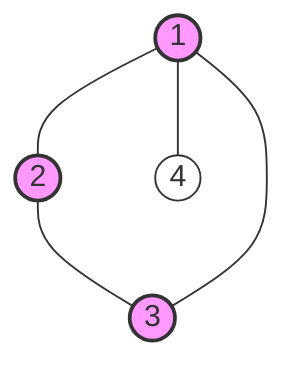

# Quadratic Knapsack Problem (QKP)

## 1. Formal Definition

The **Quadratic Knapsack Problem (QKP)** extends the classic Knapsack Problem by introducing pairwise interaction profits between items. While the weight constraint remains linear, the objective function becomes quadratic.

**Mathematical Formulation**:
Maximize:
$$
Z = \sum_{i=1}^n p_i x_i + \sum_{i=1}^{n-1} \sum_{j=i+1}^n p_{ij} x_i x_j
$$
Subject to:
$$
\sum_{i=1}^n w_i x_i \le W, \quad x_i \in \{0, 1\}
$$

*   $p_i$: Linear profit (value of item $i$ alone).
*   $p_{ij}$: Quadratic/Interaction profit (additional value if **both** $i$ and $j$ are selected).

## 2. Complexity Class

QKP is **Strongly NP-hard**.
Unlike the linear knapsack problem, it cannot be solved in pseudo-polynomial time (unless P=NP). This is proven by generalization from the **Maximum Clique Problem**.

### Reduction from Maximum Clique
**Problem**: Does a graph $G=(V, E)$ contain a clique of size $k$?
**Reduction to QKP**:
1.  Create an item for each vertex $v_i$. Set weight $w_i = 1$ and individual profit $p_i = 0$.
2.  Set Knapsack Capacity $W = k$.
3.  Set interaction profit $p_{ij} = 1$ if edge $(i, j) \in E$, else $0$.
4.  **Conclusion**: The optimal solution has value $k(k-1)/2$ (number of edges in a $k$-clique) **if and only if** a clique of size $k$ exists.

*In this graph, selecting $\{1, 2, 3\}$ with $k=3$ gives value $1+1+1=3$ edges. If we selected non-clique $\{1, 2, 4\}$, value would be $1+0+1=2$.*

## 3. Applications

### 3.1. Economy: Portfolio Selection
The Markowitz model maximizes expected return while minimizing risk (variance).
*   **Formulation**: Maximize $\sum \mu_i x_i - \lambda \sum \sum \sigma_{ij} x_i x_j$ subject to budget.
*   The "risk" term $\sigma_{ij}$ (covariance) represents the quadratic penalty.

<b>Numeric Example: Portfolio (Click to Expand)</b>

**Assets**: $A, B$.
*   Returns: $r_A = 10, r_B = 15$.
*   Covariance (Risk): $\sigma_{AB} = 4$ (penalty).
*   Selection: Must choose exactly 2 assets ($W=2, w_i=1$). Constant $\lambda = 1$.

**Calculation**:
$$ \text{Value} = (10 x_A + 15 x_B) - (4 x_A x_B) $$
If we verify choosing both ($x_A=1, x_B=1$):
$$ \text{Total} = 25 - 4 = 21 $$

### 3.2. Graph Theory: Density Problems
Finding the densest subgraph with $k$ vertices. This is exactly the QKP formulation used in the complexity proof.

<b>Numeric Example: Densest Subgraph (Click to Expand)</b>

**Graph**: 4 Nodes. Edges: $(1,2), (2,3), (3,4), (4,1), (1,3)$. capacity $W=3$.
**Objective**: Maximize edges within subset of size 3.
**QKP Parameters**: $p_i=0$, $p_{ij}=1$ for edges.

**Candidates**:
1.  $\{1, 2, 3\}$: Edges $(1,2), (2,3), (1,3)$. Value = 3.
2.  $\{1, 2, 4\}$: Edges $(1,2), (4,1)$. Edge $(2,4)$ missing. Value = 2.
3.  $\{2, 3, 4\}$: Edges $(2,3), (3,4)$. Value = 2.

**Optimal**: $\{1, 2, 3\}$ (Triangle).

### 3.3. Telecommunications & Transport
**Hub Location Problem**: locating hubs to maximize traffic flow. Traffic flows between **pairs** of hubs, so profit is generated only if both endpoints $i$ and $j$ are opened ($x_i x_j = 1$).

### 3.4. Telecommunications: Network Reliability
Design of reliable networks where $p_{ij}$ represents the value of a connection (or reliability gain) between nodes $i$ and $j$. The goal is to maximize total reliability measure within a budget constraint.

### 3.5. Logistics: Interaction Effects
Load planning where items may have positive or negative interactions (e.g., chemical compatibility, weight distribution balance). If items $i$ and $j$ are incompatible, $p_{ij}$ is a large negative penalty.

## 4. Solving Techniques

### 4.1. Linearization (Exact)
Standard method to solve QKP using Mixed Integer Programming (MIP) solvers.
1.  **Variable Substitution**: Replace quadratic term $x_i x_j$ with continuous variable $y_{ij}$.
2.  **RLT Constraints**: Add "Reformulation Linearization Technique" constraints to enforce $y_{ij} = x_i \land x_j$.

$$
\begin{cases}
y_{ij} \le x_i \\
y_{ij} \le x_j \\
y_{ij} \ge x_i + x_j - 1 \\
y_{ij} \ge 0
\end{cases}
$$

<b>Step-by-Step Example (Click to Expand)</b>

**QKP**: Max $3x_1 + 4x_2 + 10x_1 x_2$ s.t. $x_1 + x_2 \le 2$.

**Linearized MIP**:
Maximize $3x_1 + 4x_2 + 10y_{12}$
Subject to:
1.  $x_1 + x_2 \le 2$ (Knapsack)
2.  $y_{12} \le x_1$
3.  $y_{12} \le x_2$
4.  $y_{12} \ge x_1 + x_2 - 1$
5.  $x \in \{0, 1\}, y \ge 0$

**Verification**:
*   If $x_1=1, x_2=0$: Constraints imply $y_{12} \le 1, y_{12} \le 0 \implies y_{12}=0$. Obj $= 3$.
*   If $x_1=1, x_2=1$: Constraint (4) implies $y_{12} \ge 1+1-1=1$. Max implies $y_{12}=1$. Obj $= 3+4+10 = 17$.

### 4.2. Lagrangian Relaxation (Upper Bounds)

Lagrangian relaxation provides a tight upper bound on the optimal value by relaxing the "hard" constraints into the objective function with a penalty multiplier.

**Formulation**:
Relax the capacity constraint $\sum w_i x_i \le W$ using a multiplier $\lambda \ge 0$.
The problem decomposes into an **Unconstrained Quadratic Binary Optimization (QUBO)** problem:

$$
\begin{aligned}
L(\lambda) &= \max_{x \in \{0,1\}^n} \left[ \sum_{i} p_i x_i + \sum_{i<j} p_{ij} x_i x_j + \lambda \left( W - \sum_{i} w_i x_i \right) \right] \\
&= \max_{x \in \{0,1\}^n} \left[ \sum_{i} (p_i - \lambda w_i) x_i + \sum_{i<j} p_{ij} x_i x_j \right] + \lambda W
\end{aligned}
$$

**Properties**:
*   For any $\lambda \ge 0$, $L(\lambda) \ge Z_{opt}$ (Upper Bound).
*   The tightest bound is found by minimizing $L(\lambda)$ over $\lambda \ge 0$.

<b>Numeric Example: Lagrangian Relaxation (Click to Expand)</b>

**Instance**: $n=3$, Capacity $W=10$.
*   **Weights**: $w = [3, 4, 5]$.
*   **Linear profits**: $p = [10, 12, 15]$.
*   **Interaction**: $p_{12}=5, p_{13}=4, p_{23}=6$.
*   **Objective**: $10x_1 + 12x_2 + 15x_3 + 5x_1x_2 + 4x_1x_3 + 6x_2x_3$.

**Step 1: Relax with $\lambda = 3$**
New Linear Coefficients $p'_i = p_i - \lambda w_i$:
*   $p'_1 = 10 - 3(3) = 1$.
*   $p'_2 = 12 - 3(4) = 0$.
*   $p'_3 = 15 - 3(5) = 0$.
Constant term: $\lambda W = 3(10) = 30$.

**Step 2: Solve QUBO**
Maximize $1x_1 + 0x_2 + 0x_3 + 5x_1x_2 + 4x_1x_3 + 6x_2x_3 + 30$.
Since all coeffs are non-negative, set $x_1=1, x_2=1, x_3=1$.
$$ L(3) = 1 + 0 + 0 + 5 + 4 + 6 + 30 = 46 $$

**Verification**:
Actual Optimal Feasible Solution is $\{2, 3\}$ (weight $4+5 \le 10$).
Value: $12 + 15 + 6 = 33$.
Upper Bound holds: $46 \ge 33$.

### 4.3. Other Bounding Techniques
*   **Gilmore-Gomory**: Specialized bounds for QKP using gradient-like linearization.
*   **Semidefinite Programming (SDP)**: Provides very tight bounds via semidefinite relaxations of the quadratic term, solvable in polynomial time.

### 4.4. Lagrangian Decomposition
Decomposes the problem by duplicating variables ($x_i = x'_i$).
*   One set of variables handles the linear knapsack constraint.
*   The other set handles the quadratic objective.
*   Lagrangian multipliers penalize the difference $x_i - x'_i$, effectively splitting the difficult QKP into a **Linear Knapsack Problem** and an **Unconstrained Quadratic** problem, both of which are easier to solve.

### 4.5. Aggressive Reduction
For large-scale instances ($n > 1000$), solvers use the gap between Upper Bounds (UB) and Lower Bounds (LB) to fix variables permanently.
*   If $UB(x_i=0) < LB$, then $x_i$ **must** be 1 in any optimal solution.
*   If $UB(x_i=1) < LB$, then $x_i$ **must** be 0.
This drastically reduces the effective problem size.

## 5. Advanced Research Formulations

### 5.1. Reoptimization (Sensitivity Analysis)
When the knapsack capacity $W$ varies (dynamic environments), re-solving QKP from scratch is inefficient.
*   **Lagrangian Dual Sensitivity**: The optimal Lagrange multiplier $\mu^*$ from a previous capacity $W$ provides a "warm start" for the new problem.
*   The Lagrangian dual function is convex and piecewise linear. Small changes in $W$ often keep the optimal $\mu$ close, allowing for rapid convergence using sub-gradient methods.

### 5.2. Quadratic Convex Reformulation (QCR)
A technique to transform the non-convex $x^T Q x$ objective into a convex form for relaxations.
*   **Idea**: Add a zero-value term $\sum u_i (x_i^2 - x_i)$ to the objective (since $x_i^2 - x_i = 0$ for binary variables).
*   **Method**: Use **Semidefinite Programming (SDP)** to find parameters $u_i$ such that the new quadratic matrix $(Q + \text{diag}(u))$ is negative semi-definite.
*   **Result**: The continuous relaxation becomes a concave maximization problem, providing extremely tight bounds.

### 5.3. Upper Planes
Construction of valid linear upper bounding functions $L(x) \ge f(x)$ for the quadratic objective using **Upper Planes**.
*   Standard linearizations (like logic cuts) can be viewed as facets of the Boolean Quadric Polytope.
*   Upper planes allow the use of highly optimized linear knapsack solvers (like `minknap`) to compute bounds for the quadratic problem.

---

## 6. Related Problems

*   **[Knapsack Problem](00-knapsack_problem.md)**: The classic linear version ($p_{ij} = 0$).

---

## 7. References

1.  **Letocart, L., Plateau, M. C., & Plateau, G.** (2012). *Reoptimization of the Quadratic Knapsack Problem*. Univ. Paris 13. [PDF](https://www-lipn.univ-paris13.fr/~letocart/QKP_Reopt.pdf)
2.  **Pisinger, D.** (2004). *The Quadratic Knapsack Problem — A Survey*. Technical Report, Univ. Copenhagen. [PDF](https://di.ku.dk/forskning/Publikationer/tekniske_rapporter/tekniske-rapporter-2004/04-11.pdf)
3.  **Billionnet, A., Elloumi, S., & Lambert, A.** (2010). *Exact Solver for QKP using Quadratic Convex Reformulation*. [HAL-00529672](https://hal.science/hal-00529672)
4.  **Wikipedia**: [Quadratic knapsack problem](https://en.wikipedia.org/wiki/Quadratic_knapsack_problem)
