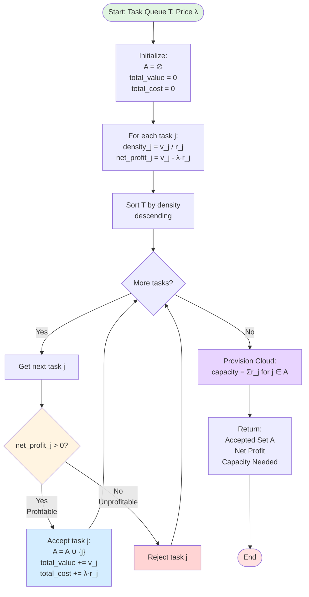
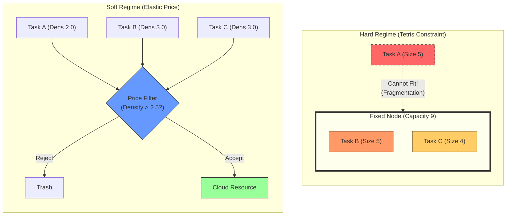

# Resource Allocation Problems

This conspect explores the connection between Knapsack problems and modern Resource Allocation, particularly in cloud computing and cluster scheduling. It demonstrates how "softening" rigid constraints transforms the problem from an NP-Hard combinatorial challenge into a tractable Linear Programming (LP) model.

## 1. Introduction

Resource allocation is a generalization of the Knapsack problem where "items" (tasks, VMs, pods) consume multiple dimensions of resources (CPU, RAM, Disk) and must be packed into "bins" (nodes, servers).

*   **Classical View**: Fixed infrastructure capacity $\implies$ **Hard Constraints**.
*   **Modern View**: Cloud/Elastic infrastructure $\implies$ **Soft Constraints** (Pay-for-use).

## 2. The Hard Regime: Fixed Infrastructure

When the number of nodes and their capacities are strictly fixed (e.g., bare-metal clusters), the problem is a **Multi-dimensional Multiple Knapsack Problem (MMKP)** or **Vector Bin Packing**.

### 2.1. Formalization (MMKP)
*   Let $J = \{1, \dots, m\}$ be the set of tasks.
*   Let $N = \{1, \dots, n\}$ be the set of nodes.
*   **Parameters**:
    *   $\mathbf{v} \in \mathbb{R}^m$: Value/Priority of each task. We denote $v_j$ as the value of task $j$.
    *   $\mathbf{R} \in \mathbb{R}^{m \times d}$: Resource requests ($d$ dimensions). Row $j$ is task $j$'s request vector. We denote $r_{jk}$ as the amount of resource dimension $k$ required by task $j$.
    *   $\mathbf{C} \in \mathbb{R}^{n \times d}$: Fixed capacity of each node. We denote $C_{ik}$ as the capacity of resource dimension $k$ on node $i$.
*   **Variables**:
    *   $x_j \in \{0, 1\}$: Task $j$ is scheduled.
    *   $y_{ji} \in \{0, 1\}$: Task $j$ assigned to node $i$.

### 2.2. Integer Linear Program (ILP)
$$
\begin{aligned}
\text{Maximize} \quad & \sum_{j=1}^m v_j x_j \\
\text{Subject to} \quad & \sum_{j=1}^m r_{jk} y_{ji} \le C_{ik} \quad \forall i \in N, \forall k \in \{1,\dots,d\} \quad \text{(Node Capacity)} \\
& \sum_{i=1}^n y_{ji} = x_j \quad \forall j \in J \quad \text{(Assignment consistency)} \\
& x_j, y_{ji} \in \{0, 1\}
\end{aligned}
$$

**Complexity**: **Strongly NP-Hard**.
The combination of bin choices (Bin Packing) and item selection (Knapsack) with multi-dimensional constraints leads to severe intractability. Solvers (MIP) struggle as $m, n$ grow.

### 2.3. The Geometry of Interference (Dot Product Bridge)
To bridge the gap between "Tetris" intuition and formal complexity, we look at the **Dot Product** of resource requests.

For a single resource dimension and a fixed node $i$, let $\mathbf{r} = [r_1, r_2, \dots, r_m]^\top$ be the vector of resource requests for all tasks. The requirement that all assigned tasks fit into capacity $C_i$ can be written as:
$$ \mathbf{r}^\top \mathbf{y}_{:i} \le C_i $$
where $\mathbf{y}_{:i} = [y_{1i}, y_{2i}, \dots, y_{mi}]^\top$ is the assignment vector for node $i$ (which tasks are assigned to node $i$).

**Why this is NP-Hard (The "Tetris" Lock):**
1.  **Discrete Projection**: The decision vector $\mathbf{y}_{:i}$ is binary. The dot product is not a smooth projection but a selection of discrete "blocks".
2.  **Multidimensional Interference**: With $d$ resources, we have $d$ simultaneous dot products:
    $$\mathbf{R}^\top \mathbf{y}_{:i} \preceq \mathbf{C}_i$$
    A task might "fit" in the CPU dimension but "collide" in the Memory dimension. This multi-axis interference means you can't simply sort by one density; you must solve a combinatorial puzzle where tasks "block" each other across different resource axes.
3.  **Cross-Node Competition**: Because $\sum_i y_{ji} = 1$, tasks must choose which node to "consume". The intersection of these discrete dot product constraints across all $n$ nodes creates a rigid state-space where most configurations are invalid, leading to the exponential search complexity typical of NP-Hard problems.

<details>
<summary><strong>Numeric Example: Bound by the Dot Product</strong></summary>

**Scenario**: 2 Tasks, 1 Node (Capacity: 10 CPU, 10 RAM).
*   **Task 1**: $\mathbf{r}_1 = [8, 3]^\top$ (Heavy CPU)
*   **Task 2**: $\mathbf{r}_2 = [3, 8]^\top$ (Heavy RAM)

**Decision**: Attempt to schedule both ($\mathbf{y} = [1, 1]^\top$).
*   **CPU Check**: $[8, 3] \cdot [1, 1] = 8(1) + 3(1) = \mathbf{11} > 10$. (**Fail**)
*   **RAM Check**: $[3, 8] \cdot [1, 1] = 3(1) + 8(1) = \mathbf{11} > 10$. (**Fail**)

**Analysis**: Even though total units ($11$) only slightly exceed capacity, the "shape" of the requests—represented by the resource vectors—creates a collision in both dimensions. In the Hard Regime, you are "locked" by the worst-performing dot product.
</details>

---

## 3. The Soft Regime: Elastic Infrastructure

In cloud environments (e.g., Kubernetes Autoscaling, Spot Instances), node capacities are not fixed constants but **decisions**. We pay for the resources we provision. This assumption "softens" the problem.

### 3.1. Key Relaxations
1.  **Elasticity**: Capacities $C_{ik}$ become decision variables $c_{ik}$.
2.  **Linear Cost**: Objective becomes `Value - Cost`.
3.  **Single-Dimension Dominance**: In practice, one resource (e.g., CPU) often bottlenecks the cost, allowing decoupling of dimensions.

### 3.2. Linear Programming Formulation (LP)
We relax integrality ($x_j \in [0,1]$) and treat node sizing as continuous.

*   **Variables**:
    *   $x_j \in [0, 1]$: Fraction of task $j$ scheduled.
    *   $y_{ji} \in [0, 1]$: Fraction of task $j$ assigned to node $i$ (relaxed from binary).
    *   $c_{i} \ge 0$: Capacity provisioned for node $i$.
*   **Parameters** (simplified to single dimension $d=1$ for clarity):
    *   $r_j$: Resource request of task $j$.
    *   $\lambda$: Unit cost of resource (price per CPU, RAM, etc.).

$$
\begin{aligned}
\text{Maximize} \quad & \sum_{j=1}^m v_j x_j - \lambda \sum_{i=1}^n c_i \\
\text{Subject to} \quad & \sum_{j=1}^m r_j y_{ji} \le c_i \quad \forall i \in N \\
& \sum_{i=1}^n y_{ji} = x_j \quad \forall j \in J \\
& 0 \le x_j, y_{ji} \le 1, \quad c_i \ge 0
\end{aligned}
$$

**Complexity**: **Polynomial (P)** — Specifically **$O(m)$ for filtering**.

When capacity is elastic (we provision exactly what we use), the LP simplifies to independent per-task decisions:
*   **General LP**: Solvable in $O(n^3)$ via Interior Point methods or $O(n^{2.5})$ expected time via Simplex.
*   **Elastic Infrastructure**: The problem reduces to **filtering** (Section 4.3), which is simply $O(m)$ — one comparison per task.
*   **Contrast with Hard Regime**: Fixed infrastructure (Section 2) is **NP-Hard** due to bin-packing combinatorics.

This is **not NP-Hard**; it belongs to class **P** (polynomial time).

### 3.3. Alternative: Fractional Programming (Efficiency Maximization)

Our approach so far has used a **linear objective** (Value - Cost). Fractional programming offers an alternative perspective by directly maximizing **efficiency ratios**.

#### 1. The Fractional Objective
Instead of `max(Value - λ·Cost)`, we can pose the problem as:
$$ \text{Maximize} \quad \frac{\sum_{j=1}^m v_j x_j}{\sum_{j=1}^m r_j x_j} $$
This asks: *"What is the best **Value per Unit Resource** I can achieve?"*

#### 2. Relationship to Linear Approach
The two perspectives are **dual** to each other:
- **Linear (our approach)**: Fix price $\lambda$, maximize profit. Different $\lambda$ values trace the **efficiency frontier**.
- **Fractional**: Maximize efficiency directly, the optimal dual variable is the **shadow price**.

Mathematically, if $\lambda^*$ is the optimal ratio in the fractional problem, then:
$$ \lambda^* = \frac{\sum v_j x_j^*}{\sum r_j x_j^*} $$
and the linear problem with $\lambda = \lambda^*$ yields the same solution.

#### 3. Solving via Charnes-Cooper Transformation
The fractional program can be **transformed into a Linear Program** using the Charnes-Cooper change of variables:
- Let $t = 1 / \sum r_j x_j$ (resource reciprocal)
- Substitute $z_j = t \cdot x_j$ (note: using $z_j$ to avoid confusion with assignment variable $y_{ji}$)

The fractional LP becomes:
$$
\begin{aligned}
\text{Maximize} \quad & \sum_{j=1}^m v_j z_j \\
\text{Subject to} \quad & \sum_{j=1}^m r_j z_j = 1 \\
& z_j \ge 0
\end{aligned}
$$

This is now a **standard LP**, solvable in polynomial time.

#### 4. What Fractional Programming Adds

**Novel Insights**:
1.  **Pareto Frontier**: Varying $\lambda$ in the linear model traces the **trade-off curve** between total value and resource consumption. The fractional model finds the **maximum efficiency point** on this curve.
2.  **Budget-Agnostic**: Fractional optimization doesn't require knowing $\lambda$ upfront — useful when market prices are uncertain.
3.  **Multi-Resource Generalization**: For vector resources, we can maximize weighted efficiency:
    $$ \frac{\sum v_j x_j}{\boldsymbol{\lambda}^\top \mathbf{R}^\top \mathbf{x}} $$
    This unifies multi-dimensional filtering into a single ratio.

<details>
<summary><strong>Numeric Example: Efficiency vs. Linear</strong></summary>

**Task Set**:
- Task A: Value 10, Resource 5 (Density 2.0)
- Task B: Value 15, Resource 10 (Density 1.5)

**Scenario 1: Linear (λ = 1.8)**
- Net Profit A: $10 - 1.8(5) = 1.0$ ✅ Accept
- Net Profit B: $15 - 1.8(10) = -3.0$ ❌ Reject
- Result: Select A. Efficiency = 10/5 = **2.0**.

**Scenario 2: Fractional (Max Efficiency)**
- Only A: Efficiency 10/5 = **2.0**
- Only B: Efficiency 15/10 = **1.5**
- Both: Efficiency (10+15)/(5+10) = **1.67**
- Result: Select A. Efficiency = **2.0** (same as linear with $\lambda = 2.0$).

**Insight**: The fractional problem **automatically finds** the optimal $\lambda^* = 2.0$ without us specifying it.
</details>

**Conclusion**: Fractional programming doesn't replace our linear approach but complements it by providing:
- An alternative formulation when prices are unknown
- A direct path to the efficiency frontier
- A unifying view of multi-resource optimization

Both reduce to **P-time** solvable problems, maintaining the polynomial tractability of the elastic regime.

---

## 4. Intuitive Explanation and Proof of Compliance

To understand why "softening" the problem makes it so much easier, we can use a physical analogy.

### 4.1. The Analogy: Tetris vs. Water
*   **Hard Regime (Fixed Infrastructure)** is like **Tetris**. You have rigid blocks (tasks) and a fixed grid (node). You must fit them exactly. Small gaps are wasted. This is hard (NP-Hard).
*   **Soft Regime (Elastic Infrastructure)** is like **filling buckets with water**. Since you can resize the bucket (provision capacity on-demand) to typical cloud "pay-for-use" models, the shape doesn't matter as much. You only care if the water (task value) is worth the cost of the bucket volume (resource cost).

### 4.2. Step-by-Step Application
Here is how the mathematical formulas translate into a real-world decision process:

1.  **Calculate Value Density**: For every task $j$, calculate its "bang for buck":
    $$ \text{Density}_j = \frac{\text{Value } v_j}{\text{Resource Request } r_j} $$
2.  **Compare to Cost**: Compare this density to the market price of resources, $\lambda$ (e.g., cost per CPU-hour).
3.  **The Decision Rule**:
    *   **If Density > Price**: The task generates more value than it costs to run. **Run it.**
    *   **If Density < Price**: The task costs more than its value. **Reject it.**
    *   **If Density = Price**: It's a break-even. (Doesn't matter mathematically, practically reject).

This independent check replaces the complex "bin packing" puzzle.

#### 4.2.1. Algorithm: Soft Resource Allocation (Online, Bucket-Based)

**Data Structure**: Maintain density buckets for O(m) complexity:
```
DensityBuckets[d] = {tasks with density d}
```

**Pseudocode**:

```
Algorithm: ONLINE_SOFT_ALLOCATOR
Input:  λ = resource_price
State:  DensityBuckets = {}          // Hash map: density → task list
        max_density = -∞              // Track highest density
        total_value = 0
        total_cost = 0

// On Task Arrival (Real-time, O(1) per task)
function ON_TASK_ARRIVAL(task_j with v_j, r_j):
    density_j ← v_j / r_j
    net_profit_j ← v_j - (λ × r_j)
    
    if net_profit_j > 0 then         // Profitable task
        d ← floor(density_j)          // Discretize density
        if d not in DensityBuckets then
            DensityBuckets[d] ← []
        end if
        
        DensityBuckets[d].APPEND(task_j)  // O(1) insertion
        max_density ← MAX(max_density, d)
    else
        REJECT(task_j)                // Immediate rejection
    end if
end function

// Allocation Phase (Triggered periodically or on-demand)
function ALLOCATE_RESOURCES():
    A ← ∅                             // Accepted set
    
    // Iterate from highest to lowest density
    for d from max_density down to 0 do
        if d in DensityBuckets then
            for each task j in DensityBuckets[d] do
                A ← A ∪ {j}
                total_value ← total_value + v_j
                total_cost ← total_cost + (λ × r_j)
            end for
        end if
    end for
    
    capacity_needed ← SUM(r_j for j in A)
    PROVISION_CLOUD(capacity_needed)
    return (A, total_value - total_cost, capacity_needed)
end function
```

**Flowchart**:



**Complexity Analysis**:
- **Per Task Arrival**: O(1) — direct bucket insertion
- **Allocation Phase**: O(m) — one pass through buckets
- **Total**: **O(m)** — linear in number of tasks (vs. O(m log m) for sorting-based)

**Key Properties**:
- **No Sorting Required**: Bucket organization replaces O(m log m) sort with O(1) insertions
- **Online Processing**: Tasks processed as they arrive in real-time
- **Greedy Optimal**: Iterating buckets from high to low density guarantees optimal profit
- **Scalable**: Handles streaming workloads efficiently

**Example (Discrete Density Buckets)**:

Assume densities are discretized to integer levels (e.g., `d = floor(v/r)`):

1. Task A arrives: $v=10, r=4$ → density = 2 → `Buckets[2] = {A}`
2. Task B arrives: $v=15, r=5$ → density = 3 → `Buckets[3] = {B}`
3. Task C arrives: $v=8, r=4$ → density = 2 → `Buckets[2] = {A, C}`
4. **Allocate**: Iterate `[3 → 2]` → Accept `{B, A, C}` in density order

**Insight**: This bucket approach is **Counting Sort** applied to density dimension, achieving O(m) when the range of densities is bounded.


---
### 4.3. Proof of Softened LP Compliance
We must prove that solving the "Soft" Linear Program (LP) actually gives us a valid, non-fractional answer (0 or 1) for the real world. This is the **Integrality Property**.

**The Logic**:
1.  **Total Cost Equation**: In the elastic model, the total capacity we provision $C$ is exactly the sum of resources used by accepted tasks: $C = \sum r_j x_j$.
2.  **Substitution**: We replace the unknown "Capacity" in the objective function with the tasks' resource usage.
    *   *Original Objective*: $\text{Maximize } (\text{Total Value}) - (\text{Price} \times \text{Total Capacity})$
    *   *Substituted*: $\text{Maximize } \sum v_j x_j - \lambda \sum r_j x_j$
3.  **Regrouping**: We can group terms by task:
    $$ \text{Maximize } \sum_{j=1}^m \underbrace{(v_j - \lambda r_j)}_{\text{Net Profit}_j} \cdot x_j $$
4.  **Conclusion**:
    *   To maximize the sum, we look at each task's **Net Profit** individually.
    *   If $(v_j - \lambda r_j) > 0$, the only way to maximize the sum is to set $x_j$ to its maximum possible value, which is **1**.
    *   If $(v_j - \lambda r_j) < 0$, we must set $x_j$ to **0**.
    *   Therefore, the optimal solution to the continuous LP is **naturally integer** (0 or 1). We do not need complex integer solvers; the "soft" nature of the cloud constraint removes the fragmentation penalty that usually causes NP-Hardness.

**Time Complexity Verification**:
The filtering algorithm requires:
1.  Computing $v_j - \lambda r_j$ for each task: **$O(m)$**
2.  Comparing to zero and setting $x_j$: **$O(m)$**

**Total**: $O(m)$ — **Linear in the number of tasks** resulting clearly in **polynomial time** (class **P**). The elastic infrastructure assumption breaks the combinatorial barrier.

---
### 4.4. Advanced Filtering Heuristics

The base algorithm (Section 4.2.1) uses a simple profit check:
```
net_profit_j = v_j - λ × r_j
```

The following techniques **extend** this calculation without changing the O(m) complexity. They parameterize the `net_profit_j` computation to handle more complex scenarios:

| Extension | Modified Formula | Use Case |
|-----------|------------------|----------|
| **Weighted Scalarization** | $\text{net\_profit}_j = v_j - \boldsymbol{\lambda}^\top \mathbf{r}_j$ | Multi-dimensional resources (CPU+RAM+GPU) |
| **Shadow Pricing** | $\boldsymbol{\lambda} = \boldsymbol{\mu}$ (from LP duals) | Dynamic market-based pricing |
| **Opportunity Cost** | $\text{net\_profit}_j = v_j - (\boldsymbol{\lambda}^\top \mathbf{r}_j + \Omega)$ | Stochastic high-value arrivals |

**Key Insight**: These optimizations **plug into** the base algorithm's filtering condition (`net_profit_j > 0`), enhancing decision quality while preserving O(1) per-task complexity.

---

When the system is multi-dimensional or dynamic, basic density is not enough. We optimize the filter using these techniques:

#### 1. Weighted Resource Scalarization (The Price Vector)

**Connection to Section 3.2**: This is the **multi-dimensional extension** of the Linear Programming formulation. Where Section 3.2 used a single price $\lambda$ for one resource dimension, we now use a **price vector** $\boldsymbol{\lambda} = [\lambda_{cpu}, \lambda_{mem}, \lambda_{gpu}, \dots]^\top$.

**Formulation**: If tasks consume multiple resources, we project the multidimensional request $\mathbf{r}_j = [r_{j,cpu}, r_{j,mem}, \dots]^\top$ into a single cost scalar using a dot product:
$$ \text{Effective Cost}_j = \boldsymbol{\lambda}^\top \mathbf{r}_j = \lambda_{cpu} \cdot r_{j,cpu} + \lambda_{mem} \cdot r_{j,mem} + \dots $$

The filter threshold remains: Accept if $v_j > \boldsymbol{\lambda}^\top \mathbf{r}_j$.

**Where $\boldsymbol{\lambda}$ comes from**:
- **Market Prices**: Direct cloud pricing (e.g., $0.05/CPU-hour, $0.01/GB-hour)
- **Shadow Prices**: Dual variables $\boldsymbol{\mu}$ from LP solver (Section 4.4.2 below)
- **Fractional Optimum**: Efficiency ratio weights from Section 3.3


#### 2. Dual Shadow Pricing
In systems with a global budget or total resource cap, we solve the LP relaxed model once to find the **Dual Multipliers** (Shadow Prices). These duals represent the "hidden cost" of consuming one more unit of a scarce resource. We then use these duals as our $\lambda$ values for real-time filtering of new tasks.

#### 3. Stochastic Reservation Price
If high-value tasks arrive randomly, we might reject a "profitable" task now to save space for a "more profitable" one later. We adjust the filter by an **Opportunity Cost** term $\Omega$:
$$ \text{Filter Rule: } v_j > (\boldsymbol{\lambda}^\top \mathbf{r}_j + \Omega) $$

<details>
<summary><strong>Numeric Example: Multi-Dimension Weighted Filtering</strong></summary>

**System State**: 
*   CPU is cheap ($\lambda_{cpu} = 1.0$)
*   RAM is scarce/expensive ($\lambda_{ram} = 5.0$)

**Task J**: Value \$50, Request: 10 CPU, 5 RAM.
1.  **Naive CPU Density**: $50/10 = 5.0$. (Looks great if price is 1.0).
2.  **Weighted Scalarization**:
    $$ \text{Total Cost} = (1.0 \times 10) + (5.0 \times 5) = 10 + 25 = \mathbf{\$35} $$
3.  **Net Profit**: $50 - 35 = +\$15$.
4.  **Result**: **ACCEPT**.

**Analysis**: By using a weighted dot product, the filter automatically penalizes tasks that consume "scarce" resources, even if their primary resource (CPU) is abundant.
</details>

---

### 4.5. Deep Dive: Dual Shadow Pricing

Shadow Pricing is the bridge between **Global Optimization** (the whole cluster state) and **Local Decisions** (should I accept this one pod right now?).

#### 1. The Essence: Marginal Value
The **Shadow Price** of a resource is the answer to: *"If I could magically add exactly one more unit of CPU to my cluster right now, how much extra Value ($v$) could I generate?"*
*   **Zero Shadow Price**: The resource is in surplus (slack). Adding more won't help because something else is the bottleneck.
*   **High Shadow Price**: The resource is the primary bottleneck. It is "precious".

#### 2. Formal Definition (The Dual)
In the Linear Programming formulation of Section 3.2, every capacity constraint $\sum r_{ji} y_{ji} \le C_i$ has an associated **Dual Variable** $\mu_i$.
*   **The Primal Problem** asks: *"How many tasks can I pack to maximize value?"*
*   **The Dual Problem** (Shadow Pricing) asks: *"What is the minimum 'rental value' I must assign to each unit of resource for the cluster to break even?"*

Mathematically, if $Z^*$ is the optimal value of our objective function, then:
$$ \mu_i = \frac{\partial Z^*}{\partial C_i} $$

#### 3. Strategic Usage in Optimization
We use Shadow Pricing to create a self-correcting market inside the scheduler:
1.  **Solve Periodic LP**: Every few minutes, solve the global LP using the current "Queued" demand to get the Shadow Prices ($\boldsymbol{\mu} = [\mu_{cpu}, \mu_{mem}, \dots]$).
2.  **Set Admission Floor**: Use these $\mu$ values as the $\lambda$ parameters in our filtering rule:
    $$ \text{Accept Task } j \text{ IF: } v_j > \sum_{k} \mu_k \cdot r_{jk} $$
3.  **Dynamic Adjustment**: 
    *   As the cluster fills up with memory-heavy tasks, the **Shadow Price of Memory ($\mu_{mem}$)** will spike.
    *   This automatically makes the filter "stricter" for memory-heavy tasks, effectively reserving the remaining RAM only for the highest-value users.

<details>
<summary><strong>Numeric Example: The Price of a Bottleneck</strong></summary>

**System**: Node with 10 units of CPU.
**Queue**: 
*   Task A (Value 10, CPU 5)
*   Task B (Value 10, CPU 5)
*   Task C (Value 10, CPU 5)

**Optimal Solution**: Pick any two (Total Value 20).
**Shadow Price Analysis**:
If you increase capacity to **11**, you still can't pick Task C (needs 5). The value stays 20. Shadow Price = **$0$**.
If you increase capacity to **15**, you can now pick the 3rd task. The value jumps to 30.
The **average shadow price** over that range is $\frac{30 - 20}{15 - 10} = \mathbf{2.0}$ per CPU. 

**Application**: To "buy" your way into this node, a task must have a Value Density $> 2.0$.
</details>

---

## 5. Heuristic Approximations: Scaled N-Node Systems

We can add a layer of generalization between the "Hard" (Single Node) and "Soft" (Infinite Cloud) regimes: the **$N$-Node Cluster**. Here, we have fixed total capacity but distributed across $N$ nodes.

Solving this optimally is still NP-Hard (Multiple Knapsack), but in practice, we use **Heuristics** (Approximation Algorithms) that simulate filling nodes on-the-line.

### 5.1. Algorithm: Density-Aware Best-Fit (Sort & Assign)

**Connection to Section 4.2.1**: This algorithm **reuses** the soft resource allocation filter but adapts it for **fixed-capacity N-node clusters**. Instead of infinite elastic capacity, we now have $N$ fixed nodes and must decide **which node** gets each profitable task.

**Key Difference**:
- **Section 4.2.1 (Soft)**: Filter tasks by `net_profit_j > 0` → Accept all profitable tasks → Provision exact capacity
- **Section 5.1 (N-Node)**: Filter tasks by density **and** find best node fit → Limited capacity → Heuristic assignment

**How the Filter is Reused**:
1. **Density Computation**: Same as Section 4.2.1 (`density_j = v_j / r_j`)
2. **Profitability Check**: Can optionally pre-filter using `net_profit_j > 0` before assignment
3. **Bucket Organization**: Can use same bucket structure from Section 4.2.1 for O(m) sorting
4. **Node Selection**: NEW step that picks which fixed node gets the task

**Algorithm Steps**:
1.  **Sort Tasks**: Order all tasks by Value Density (descending): $\text{Density}_j = v_j / r_j$ *(reuses Section 4.2.1 buckets)*.
2.  **For Each Task** (in sorted order):
    *   **Compute Node Scores**: For each node $i$, calculate its current **Utilization Density**:
        $$ \text{UtilDensity}_i = \frac{\text{Total Value on Node } i}{\\text{Total Resources Used on Node } i} $$
    *   **Best-Fit Rule**: Assign task to the node with the **highest utilization density** that still has capacity.
    *   **Rationale**: Matching high-value tasks to already-efficient nodes maintains or improves their density, avoiding "dilution" of value.

**Why This Works**:
*   High-density tasks fill nodes first (greedy by value).
*   Nodes with high utilization density are "proven winners" — adding more high-value tasks keeps them efficient.
*   This approximates the optimal bin-packing solution for large $N$ without solving an NP-Hard problem.

<details>
<summary><strong>Simulation: Filling 2 Nodes (Density-Aware Best-Fit)</strong></summary>

**Setup**:
*   **Nodes**: Node 1 (Cap 10), Node 2 (Cap 10).
*   **Stream of Tasks** (Unsorted):
    1.  Task A (Size 4, Value 8) → Density 2.0
    2.  Task B (Size 6, Value 9) → Density 1.5
    3.  Task C (Size 5, Value 15) → Density 3.0
    4.  Task D (Size 4, Value 12) → Density 3.0

**Step 1: Sort by Density**
*   **Sorted Order**: C (3.0), D (3.0), A (2.0), B (1.5)

**Step 2: Assign Greedily**

1.  **Task C** (Density 3.0, Size 5) → Both nodes empty. Assign to **Node 1**.
    *   Node 1: Used 5/10. Value 15. UtilDensity = 15/5 = **3.0**.
    
2.  **Task D** (Density 3.0, Size 4) → Check nodes:
    *   Node 1: UtilDensity 3.0. Capacity? 5+4=9 ≤ 10. ✅ **Fits**.
    *   Node 2: UtilDensity N/A (empty). 
    *   **Best Fit**: Node 1 (matches density 3.0).
    *   Node 1: Used 9/10. Value 27. UtilDensity = 27/9 = **3.0**.

3.  **Task A** (Density 2.0, Size 4) → Check nodes:
    *   Node 1: Used 9/10. 9+4=13 > 10. ❌ **No room**.
    *   Node 2: Empty. ✅ **Fits**.
    *   Assign to **Node 2**.
    *   Node 2: Used 4/10. Value 8. UtilDensity = 8/4 = **2.0**.

4.  **Task B** (Density 1.5, Size 6) → Check nodes:
    *   Node 1: 9+6=15 > 10. ❌ **No room**.
    *   Node 2: 4+6=10. ✅ **Fits**.
    *   Assign to **Node 2**.
    *   Node 2: Used 10/10. Value 17. UtilDensity = 17/10 = **1.7**.

**Final State**:
*   **Node 1**: Tasks C+D. Used 9/10. Value **27**. Avg Density **3.0**.
*   **Node 2**: Tasks A+B. Used 10/10. Value **17**. Avg Density **1.7**.

**Total Value**: **44** (vs. 44 in Round-Robin, but better utilization distribution).

**Insight**: By sorting and assigning to high-density nodes first, we concentrate high-value tasks, making some nodes "premium" and others "budget". This is useful for tiered pricing or quality-of-service strategies.
</details>


## 6. Comparative Example: Hard vs. Soft

Let's illustrate the difference with a concrete scenario.

**Scenario**: 3 Tasks, Resource = CPU.
*   **Task A**: Value \$10, Request 5 CPU (Density \$2.0/CPU)
*   **Task B**: Value \$15, Request 5 CPU (Density \$3.0/CPU)
*   **Task C**: Value \$12, Request 4 CPU (Density \$3.0/CPU)

<details>
<summary><strong>Case 1: Hard Regime (Fixed Node)</strong></summary>

**Constraints**: Single Node with Capacity **9 CPU**.

We must fit tasks into the size 9 box.
*   **Option 1 (A + C)**: Size $5+4=9$. fits. Value $10+12 = 22$.
*   **Option 2 (B + C)**: Size $5+4=9$. fits. Value $15+12 = 27$.
*   **Option 3 (A + B)**: Size $5+5=10$. **Exceeds capacity**. Invalid.

**Combinatorial Difficulty**: We had to check combinations to find the best fit. Option 3, despite having the highest raw value ($25$), was impossible due to the hard constraint ("Fragmentation").

**Result**: Select **B + C**. Value **27**. Wasted Space: 0.
</details>

<details>
<summary><strong>Case 2: Soft Regime (Elastic Cloud)</strong></summary>

**Constraints**: Unlimited scale, Cost **$\lambda = \$2.5$ per CPU**.

We strictly apply the density rule ($v_j/r_j > \lambda$).
*   **Task A**: Density $2.0$. Price $2.5$. $2.0 < 2.5 \implies$ **REJECT**.
*   **Task B**: Density $3.0$. Price $2.5$. $3.0 > 2.5 \implies$ **ACCEPT**.
*   **Task C**: Density $3.0$. Price $2.5$. $3.0 > 2.5 \implies$ **ACCEPT**.

**Linear Simplicity**: We checked each item independently. No combinations needed.
Note that Task A was rejected not because it "didn't fit" (we have infinite space), but because it wasn't *profitable*.

**Result**: Select **B + C**. Total Value 27. Total Cost $9 \times 2.5 = 22.5$. Net Profit 4.5.
</details>

### Visualizing the Transition

The following diagram contrasts the "Tetris-like" packing of the Hard Regime with the "Level-based" filtering of the Soft Regime.



---

## 6.1. Summary: Filtering Variants Within the Soft Allocation Scheme

Throughout this document, we developed a **generic soft filter framework** (Section 4.2.1) and multiple **specialized variants** that extend it for different scenarios. All variants share the core structure:

```
Generic Soft Filter:
  FOR each task j:
    Compute: net_profit_j = f(v_j, r_j, parameters)
    IF net_profit_j > threshold THEN ACCEPT
```

The following table summarizes all variants developed:

| Variant | Section | Net Profit Formula | Parameters | Use Case | Complexity |
|---------|---------|-------------------|------------|----------|------------|
| **Base (Single-Dimension)** | 4.2.1 | $v_j - \lambda \cdot r_j$ | $\lambda$ (price) | Single resource (CPU only) | O(m) |
| **Weighted Scalarization** | 4.4.1 | $v_j - \boldsymbol{\lambda}^\top \mathbf{r}_j$ | $\boldsymbol{\lambda}$ (price vector) | Multi-resource (CPU+RAM+GPU) | O(m) |
| **Shadow Pricing** | 4.4.2, 4.5 | $v_j - \boldsymbol{\mu}^\top \mathbf{r}_j$ | $\boldsymbol{\mu}$ (LP duals) | Dynamic market pricing | O(m) + O(LP solve) amortized |
| **Stochastic Reservation** | 4.4.3 | $v_j - (\boldsymbol{\lambda}^\top \mathbf{r}_j + \Omega)$ | $\Omega$ (opportunity cost) | Random high-value arrivals | O(m) |
| **Fractional Efficiency** | 3.3 | $\frac{\sum v_j x_j}{\sum r_j x_j}$ (global) | $\lambda^*$ (efficiency ratio) | Budget-agnostic optimization | O(m) via Charnes-Cooper |
| **N-Node Best-Fit** | 5.1 | Reuses base + node scoring | Density + UtilDensity | Fixed N-node clusters | O(m·N) |

### Parameter Sources

The key to all variants is choosing appropriate parameters:

| Parameter | How to Obtain | When to Use |
|-----------|---------------|-------------|
| **$\lambda$ (scalar)** | Market price, cloud pricing | Single resource, known cost |
| **$\boldsymbol{\lambda}$ (vector)** | Multi-resource market prices | CPU+RAM+GPU, known costs |
| **$\boldsymbol{\mu}$ (duals)** | Solve LP periodically (Section 4.5) | Unknown prices, dynamic demand |
| **$\lambda^*$ (ratio)** | Fractional programming (Section 3.3) | Budget-agnostic, maximize efficiency |
| **$\Omega$ (opportunity)** | Statistical estimation, forecasting | Stochastic arrivals, capacity reservation |

### Unified Framework

All filtering variants follow the same execution pattern:

```
1. Parameterization Phase (choose λ, μ, or Ω)
   ├─ Static: Use market prices
   ├─ Dynamic: Solve LP for shadow prices
   └─ Adaptive: Update Ω based on arrival statistics

2. Filtering Phase (Section 4.2.1 base algorithm)
   ├─ Compute density_j for bucket organization
   ├─ Compute net_profit_j using chosen parameters
   └─ Accept if net_profit_j > 0

3. Allocation Phase
   ├─ Infinite capacity: Provision exactly Σr_j (Soft, Section 4.2.1)
   └─ Fixed capacity: Assign to best node (N-Node, Section 5.1)
```

### Key Insights

1. **O(m) Complexity Preserved**: All variants maintain linear time per task (filtering remains O(1))
2. **Plug-in Architecture**: Parameters change, algorithm structure stays the same
3. **Incremental Sophistication**: Start simple (scalar λ), add complexity as needed (vector, duals, stochastic)
4. **Theoretical Grounding**: All variants derive from LP (Section 3.2) or Fractional (Section 3.3) formulations

This unified view shows that soft resource allocation is not multiple algorithms but **one flexible framework** parameterized for different operational scenarios.

---

---

## 7. Related Problems

*   **[Knapsack Problem (Main)](00-knapsack_problem.md)**: The classical 0/1 Knapsack and its complexity analysis.
*   **[Multiple Knapsack Problem](03-multiple_subset_sum_problem.md)**: The general case of distributing items into multiple bins.

---

## 8. Conclusion

*   **Fixed Infrastructure** requires solving the **NP-Hard** MMKP to manage fragmentation and packing efficiency.
*   **Elastic Infrastructure** allows transforming the problem into simple **Filtering/Knapsack-style** decisions based on value density, solvable in linear time or via simple LP.