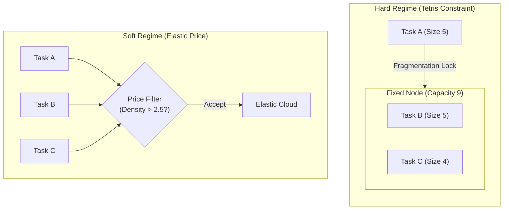

# Resource Allocation Problems

This conspect explores the connection between Knapsack problems and modern Resource Allocation, particularly in cloud computing and cluster scheduling. It demonstrates how "softening" rigid constraints transforms the problem from an NP-Hard combinatorial challenge into a tractable Linear Programming (LP) model.

## 1. Introduction

Resource allocation is fundamentally a **Linear Integer Programming (ILP)** problem. It involves making discrete decisions ("Should I run this task?") under rigid resource constraints.

*   **ILP Basis**: The problem is defined by a set of linear inequalities where decision variables are binary (0 or 1). 
*   **Knapsack Implication**: In this specific domain, the ILP constraints take the form of capacity limits. This makes resource allocation a **generalization of the Knapsack problem**. It is important to note that the Knapsack structure is an *implication* of how general ILP rules are applied to resource consumption, not the root cause of the problem's complexity.
*   **Paradigm Shift**:
    *   **Classical View**: Fixed infrastructure capacity $\implies$ **Hard Constraints (ILP)**.
    *   **Modern View**: Cloud/Elastic infrastructure $\implies$ **Soft Constraints (Linear Programming)**.

## 2. The Hard Regime: Fixed Infrastructure

When the number of nodes and their capacities are strictly fixed (e.g., bare-metal clusters), the problem is a **Multi-dimensional Multiple Knapsack Problem (MMKP)** or **Vector Bin Packing**.

### 2.1. Formalization (MMKP)
*   Let $J = \{1, \dots, m\}$ be the set of tasks.
*   Let $N = \{1, \dots, n\}$ be the set of nodes.
*   **Parameters**:
    *   $\mathbf{v} \in \mathbb{R}^m$: Value/Priority of each task. We denote $v_j$ as the value of task $j$.
    *   $\mathbf{R} \in \mathbb{R}^{m \times d}$: Resource requests ($d$ dimensions). Row $j$ is task $j$'s request vector. We denote $r_{jk}$ as the amount of resource dimension $k$ required by task $j$.
    *   $\mathbf{C} \in \mathbb{R}^{n \times d}$: Fixed capacity of each node. We denote $C_{ik}$ as the capacity of resource dimension $k$ on node $i$.
*   **Variables**:
    *   $x_j \in \{0, 1\}$: Task $j$ is scheduled.
    *   $y_{ji} \in \{0, 1\}$: Task $j$ assigned to node $i$.

### 2.2. Integer Linear Program (ILP)
$$
\begin{aligned}
\text{Maximize} \quad & \sum_{j=1}^m v_j x_j \\
\text{Subject to} \quad & \sum_{j=1}^m r_{jk} y_{ji} \le C_{ik} \quad \forall i \in N, \forall k \in \{1,\dots,d\} \quad \text{(Node Capacity)} \\
& \sum_{i=1}^n y_{ji} = x_j \quad \forall j \in J \quad \text{(Assignment consistency)} \\
& x_j, y_{ji} \in \{0, 1\}
\end{aligned}
$$

**Complexity**: **Strongly NP-Hard**.
The combination of bin choices (Bin Packing) and item selection (Knapsack) with multi-dimensional constraints leads to severe intractability. Solvers (MIP) struggle as $m, n$ grow.

### 2.3. The Geometry of Interference (Dot Product Bridge)

To move beyond "Tetris" intuition, we analyze resource constraints as a **discrete search problem** across a resource grid, using the **Dot Product**.

For a single resource dimension $k$ and a fixed node $i$, let $\mathbf{r}_k = [r_{1k}, r_{2k}, \dots, r_{mk}]^\top$ be the vector of resource requests. The constraint is:
$$ \mathbf{r}_k^\top \mathbf{y}_{:i} \le C_{ik} $$

#### 1. Dot Product as "Occupation Size"
The dot product $\mathbf{r}_k^\top \mathbf{y}_{:i}$ represents the **total size** of the grid space occupied by the selected tasks on node $i$.
- $\mathbf{y}_{:i}$ is our "search coordinate" in a discrete $m$-dimensional space.
- The dot product "weights" each dimension by the resource request $r_{jk}$.
- Solving the allocation problem is equivalent to exploring a **discrete grid of combinations** to find the set $\mathbf{y}$ that packs the most value without exceeding the "size" limit $C$.

#### 2. Why this is NP-Hard (The Brute Force Barrier)
The hardness of the Hard Regime is the difficulty of **pure brute-force packing**:
1.  **Combinatorial Explosion**: With $m$ tasks, there are $2^m$ possible configurations of $\mathbf{y}_{:i}$. For a cluster with 50 tasks, this is over $2^{50} \approx 10^{15}$ combinations—far too many to check one-by-one.
2.  **Lattice Locking**: Because decisions are binary (0 or 1), we cannot "slide" tasks into better positions like we can with continuous values. We are jumping between fixed lattice points in an $m$-dimensional grid.
3.  **Multidimensional Collisions**: In many-resource systems, a task might occupy a small "size" in CPU but a massive "size" in RAM. These collisions across different resource grids force the search algorithm to backtrack constantly, making the packing process exponentially slow.

#### 3. Formal Hardness: Discrete Intersection
The search for a binary vector that satisfies $\mathbf{R}^\top \mathbf{y}_{:i} \preceq \mathbf{C}_i$ is the **Multi-dimensional Multiple Knapsack Problem (MMKP)**. It is NP-hard because there is no shortcut to navigating the lattice; finding the global optimum requires a search space that grows exponentially with the number of tasks, as the "geometry" of the grid offers no smooth gradient to follow.

<details>
<summary>Numeric Example: Lattice Blockage</summary>

**Scenario**: 2 Tasks, 1 Node (Capacity: 10 CPU, 10 RAM).
*   **Task 1**: $\mathbf{r}_1 = [8, 3]^\top$
*   **Task 2**: $\mathbf{r}_2 = [3, 8]^\top$

**Lattice Points**:
- $Y = [0, 0]$ (Empty): Cost $[0, 0] \le [10, 10]$ ✅
- $Y = [1, 0]$ (Task 1): Cost $[8, 3] \le [10, 10]$ ✅
- $Y = [0, 1]$ (Task 2): Cost $[3, 8] \le [10, 10]$ ✅
- $Y = [1, 1]$ (Both): Cost $[11, 11] \not\le [10, 10]$ ❌

**Analysis**: The "collision" occurs because the vector sum of Task 1 and Task 2 deviates from the origin faster than the individual bounds allow. In the Hard Regime, we are searching for the "maximal lattice point" within the polyhedron, which is a combinatorial nightmare.

</details>

---

## 3. The Soft Regime: Elastic Infrastructure

In cloud environments (e.g., Kubernetes, Serverless), resource constraints are rarely absolute. Capacities can be provisioned on-demand, transforming the technical problem of "packing" into an economic problem of **efficiency**. This transition is a process of **Linearization**.

### 3.1. Theoretical Transition: From ILP to LP

The transition from the Hard Regime (ILP) to the Soft Regime (LP) is not a "default" relaxation, but a deliberate process of **Linearization and Softening**. We move from a rigid combinatorial space into a **Fractional Mixed-Integer** optimization context.

#### 1. The Mechanism of Linearization
The primary cause of linearization is the **Elastic Capacity** assumption.
- **Hard Regime**: Total capacity $C$ is fixed. Decisions $y_{ji}$ are coupled because tasks compete for the same finite space. This creates the "Tetris" interference.
- **Soft Regime**: We assume we can provision capacity on-demand ($c_k = \sum r_{jk} x_j$). By making capacity a variable that scales with demand, we **decouple** the tasks. Each task's admission is now an independent local check, turning the global MMKP into a series of $m$ linear decisions.

#### 2. Fractional Softening
While the final decision ($x_j$) remains binary in intent (either a task runs or it doesn't), the optimization process is softened by allowing:
- **Fractional Coefficients**: Values $v_j$ and costs $\lambda \cdot r_j$ can be real numbers.
- **Fractional Densities**: The "Bang-per-buck" ratio ($v_j / r_j$) is treated as a continuous variable.
- **Integer Resources**: Resource limits ($C$) often remain integers, but the *effective* cost calculation is performed in the fractional domain.

#### 3. General Linear Programming Formulation
This softening allows us to pose the problem as a continuous LP:
$$
\begin{aligned}
\text{Maximize} \quad & \sum_{j=1}^m v_j x_j - \lambda \sum_{k=1}^d r_{jk} x_j \\
\text{Subject to} \quad & 0 \le x_j \le 1
\end{aligned}
$$
By operating in this fractional space, we can use gradient-based filtering rules that are impossible in the discrete lattice of the Hard Regime.

#### 4. Proof of Compliance (Integrality Property)
We must justify why this continuous "Soft" approach is valid for a discrete "Hard" reality.
- **Regrouping**: The objective $\sum v_j x_j - \lambda \sum r_j x_j$ can be rewritten as:
  $$ \text{Maximize } \sum_{j=1}^m \underbrace{(v_j - \lambda r_j)}_{\text{Net Profit}_j} \cdot x_j $$
- **The Threshold Rule**: Since each $x_j$ is independent, to maximize the total, we set $x_j = 1$ if $(v_j - \lambda r_j) > 0$ and $x_j = 0$ otherwise.
- **Conclusion**: The LP relaxation **naturally yields integer solutions** (0 or 1). This is a known technique where softening a constraint (elastic capacity) removes the combinatorial interference, linearizing the complexity class from **NP-Hard** to **P**.

### 3.2. Intuitive Explanation: Tetris vs. Water

To understand why this is so much easier, consider the physical analogy:
- **Hard Regime** is like **Tetris**. You have rigid tasks (blocks) and a fixed node (grid). Small gaps are wasted (fragmentation). You must solve a puzzle.
- **Soft Regime** is like **filling buckets with water**. Since you can resize the bucket (elastic capacity), "shape" doesn't matter. You only care if the "water" (task value) is worth the cost of the "volume" (resource price).

### 3.3. Comparative Example: Hard vs. Soft

Let's validate this transition with a concrete scenario: 3 Tasks, 1 Resource (CPU).
- **Task A**: \$10, 5 CPU (Dens 2.0) | **Task B**: \$15, 5 CPU (Dens 3.0) | **Task C**: \$12, 4 CPU (Dens 3.0)

<details>
<summary>Numeric Example: Case 1 - Hard Regime (Fixed Node, Cap 9)</summary>

**Constraint**: Must fit in a size 9 box.
- **A+C**: Size 9, Value \$22.
- **B+C**: Size 9, Value \$27. ✅
- **A+B**: Size 10, **Does not fit**.

**Analysis**: We were forced to reject A+B even though they had raw value \$25 due to "Fragmentation".

</details>

<details>
<summary>Numeric Example: Case 2 - Soft Regime (Elastic Cloud, Price = 2.5)</summary>

**Decision Rule**: $v_j/r_j > 2.5$.
- **Task A**: 2.0 < 2.5 ❌ **Reject**.
- **Task B**: 3.0 > 2.5 ✅ **Accept**.
- **Task C**: 3.0 > 2.5 ✅ **Accept**.

**Analysis**: Tasks are checked independently. Task A is rejected not because it "doesn't fit", but because it isn't profitable at current market prices.

</details>

#### Visualizing the Transition


## 4. Alternative Filter Definitions

The "Linear Profit" model ($v - \lambda r$) introduced in Chapter 3 is the most common way to soften a resource allocation problem, but it is not the only one. We can define the **filter logic** through different mathematical lenses.

### 4.1. Efficiency Interpretation: Fractional Programming

Instead of maximizing total profit, we can maximize the **Efficiency Ratio** of the entire system. This is an alternative statement of the softened approach that focuses on "bang-for-buck" without requiring an upfront price $\lambda$.

#### 1. The Fractional Objective
We pose the problem as maximizing the value-per-unit-resource:
$$ \text{Maximize} \quad \Phi = \frac{\sum_{j=1}^m v_j x_j}{\sum_{j=1}^m r_j x_j} $$

#### 2. Duality with Linear Filter
As shown in Section 3.1, the linear and fractional models are dual perspectives. In the fractional model, the system **automatically discovers** the optimal shadow price $\lambda^*$:
$$ \lambda^* = \Phi_{\text{max}} $$
This implies that maximizing global efficiency is equivalent to running a linear filter where the threshold is set to the highest achievable efficiency ratio.

<details>
<summary>Numeric Example: Efficiency vs. Linear Filter</summary>

**Task Set**:
- Task A: Value 10, Resource 5 (Density 2.0)
- Task B: Value 15, Resource 10 (Density 1.5)

**Scenario 1: Linear Filter (λ = 1.8)**
- Net Profit A: $10 - 1.8(5) = 1.0$ ✅ **Accept**
- Net Profit B: $15 - 1.8(10) = -3.0$ ❌ **Reject**
- **Result**: Select A. Efficiency = 10/5 = **2.0**.

**Scenario 2: Fractional Filter (Max Efficiency)**
- Only A: Efficiency 10/5 = **2.0**
- Only B: Efficiency 15/10 = **1.5**
- Both: Efficiency (10+15)/(5+10) = **1.67**
- **Result**: Select A. Efficiency = **2.0**.

**Insight**: The fractional problem **automatically finds** the optimal threshold $\lambda^* = 2.0$ without requiring an external price.

</details>

### 4.2. Basis Change: The Charnes-Cooper Transformation

To solve the fractional filter as a standard Linear Program, we perform a coordinate transformation known as the **Charnes-Cooper Transformation**. This can be viewed as a **change of basis** that linearizes the ratio.

#### 1. Mathematical Transformation
We change the problem's coordinate system such that the total resource consumption is normalized:
- **Scaling Factor**: Let $t = 1 / \sum r_j x_j$.
- **New Basis**: Define $z_j = t \cdot x_j$.

In this new basis, the constraint $\sum r_j z_j = 1$ replaces the varying denominator. The objective becomes a standard linear sum $\sum v_j z_j$.

#### 2. Why it Matters
This transformation proves that **ratio-based filtering** is structurally identical to **linear profit-based filtering**. By changing the "basis" of our resource metrics, we map a non-linear efficiency ratio into a linear space, preserving the $O(1)$ per-task decision capability.

---

#### 4.2.1. Algorithm: Soft Resource Allocation (Online, Bucket-Based)

**Data Structure**: Maintain density buckets for O(m) complexity:
```
DensityBuckets[d] = {tasks with density d}
```

**Pseudocode**:

```
Algorithm: ONLINE_SOFT_ALLOCATOR
Input:  λ = resource_price
State:  DensityBuckets = {}          // Hash map: density → task list
        max_density = -∞              // Track highest density
        total_value = 0
        total_cost = 0

// On Task Arrival (Real-time, O(1) per task)
function ON_TASK_ARRIVAL(task_j with v_j, r_j):
    density_j ← v_j / r_j
    net_profit_j ← v_j - (λ × r_j)
    
    if net_profit_j > 0 then         // Profitable task
        d ← floor(density_j)          // Discretize density
        if d not in DensityBuckets then
            DensityBuckets[d] ← []
        end if
        
        DensityBuckets[d].APPEND(task_j)  // O(1) insertion
        max_density ← MAX(max_density, d)
    else
        REJECT(task_j)                // Immediate rejection
    end if
end function

// Allocation Phase (Triggered periodically or on-demand)
function ALLOCATE_RESOURCES():
    A ← ∅                             // Accepted set
    
    // Iterate from highest to lowest density
    for d from max_density down to 0 do
        if d in DensityBuckets then
            for each task j in DensityBuckets[d] do
                A ← A ∪ {j}
                total_value ← total_value + v_j
                total_cost ← total_cost + (λ × r_j)
            end for
        end if
    end for
    
    capacity_needed ← SUM(r_j for j in A)
    PROVISION_CLOUD(capacity_needed)
    return (A, total_value - total_cost, capacity_needed)
end function
```

**Flowchart**:


**Complexity Analysis**:
- **Per Task Arrival**: O(1) — direct bucket insertion
- **Allocation Phase**: O(m) — one pass through buckets
- **Total**: **O(m)** — linear in number of tasks (vs. O(m log m) for sorting-based)

**Key Properties**:
- **No Sorting Required**: Bucket organization replaces O(m log m) sort with O(1) insertions
- **Online Processing**: Tasks processed as they arrive in real-time
- **Greedy Optimal**: Iterating buckets from high to low density guarantees optimal profit
- **Scalable**: Handles streaming workloads efficiently

**Example (Discrete Density Buckets)**:

Assume densities are discretized to integer levels (e.g., `d = floor(v/r)`):

1. Task A arrives: $v=10, r=4$ → density = 2 → `Buckets[2] = {A}`
2. Task B arrives: $v=15, r=5$ → density = 3 → `Buckets[3] = {B}`
3. Task C arrives: $v=8, r=4$ → density = 2 → `Buckets[2] = {A, C}`
4. **Allocate**: Iterate `[3 → 2]` → Accept `{B, A, C}` in density order

**Insight**: This bucket approach is **Counting Sort** applied to density dimension, achieving O(m) when the range of densities is bounded.


---
## 5. Advanced Filtering Heuristics (The Improvement Layer)

Once the core filtering logic is established, we can refine the `net_profit_j` calculation to handle complex, multi-dimensional, or dynamic environments. These heuristics act as **parameter plug-ins** for the base filter.

### 5.1. Weighted Resource Scalarization (The Price Vector)

**Connection to Section 3.1**: This is the **multi-dimensional extension** of the Linear Programming formulation. Instead of a single price $\lambda$, we use a **price vector** $\boldsymbol{\lambda} = [\lambda_{cpu}, \lambda_{mem}, \lambda_{gpu}, \dots]^\top$.

**Formulation**: We project the multidimensional request $\mathbf{r}_j$ into a single cost scalar using a dot product:
$$ \text{Effective Cost}_j = \boldsymbol{\lambda}^\top \mathbf{r}_j = \sum_{k} \lambda_k \cdot r_{jk} $$
The filter threshold remains: Accept if $v_j > \boldsymbol{\lambda}^\top \mathbf{r}_j$. This allows the filter to penalize tasks that consume disproportionate amounts of scarce resources (e.g., highly expensive GPU time).

<details>
<summary>Numeric Example: Multi-Dimension Weighted Filtering</summary>

**System State**: 
*   CPU is cheap ($\lambda_{cpu} = 1.0$)
*   RAM is scarce/expensive ($\lambda_{ram} = 5.0$)

**Task J**: Value \$50, Request: 10 CPU, 5 RAM.
1.  **Naive CPU Density**: $50/10 = 5.0$. (Looks good if price is 1.0).
2.  **Weighted Scalarization**:
    $$ \text{Total Cost} = (1.0 \times 10) + (5.0 \times 5) = 10 + 25 = \mathbf{\$35} $$
3.  **Net Profit**: $50 - 35 = +\$15$.
4.  **Result**: **ACCEPT**.

**Analysis**: By using a weighted dot product, the filter automatically penalizes tasks that consume scarce resources, ensuring the "bottleneck" (RAM) is valued higher.

</details>

### 5.2. Dual Shadow Pricing (Dynamic Market)

In systems with a global resource cap, we solve the LP relaxed model periodically to find the **Dual Multipliers** $\boldsymbol{\mu}$ (Shadow Prices). 

#### 1. The Essence: Marginal Value
The shadow price $\mu_k$ represents the **Marginal Value** of resource $k$. It answers: *"If I could add one more unit of CPU, how much extra value could I generate?"*
- **Surplus**: If a resource is in surplus, its shadow price is **0**.
- **Bottleneck**: If a resource is the primary constraint, its shadow price will spike.

#### 2. Strategic Admission Floor
We use these duals as the dynamic $\lambda$ parameters in our filter:
$$ \text{Filter Rule: } v_j > \boldsymbol{\mu}^\top \mathbf{r}_j $$
As the cluster fills up, the shadow prices for the most constrained resources increase, automatically making the filter stricter for tasks that consume them. This **reserves** the remaining capacity for only the highest-priority tasks.

<details>
<summary>Numeric Example: Shadow Pricing (The Price of a Bottleneck)</summary>

**System**: Node with 10 units of CPU.
**Queue**: 
*   Task A (Value 10, CPU 5)
*   Task B (Value 10, CPU 5)
*   Task C (Value 10, CPU 5)

**Optimal Solution**: Pick any two (Total Value 20).
**Shadow Price Analysis**:
- If capacity increases to **11**, value stays 20. Shadow Price = **$0$**.
- If capacity increases to **15**, value jumps to 30.
- **Average Shadow Price** over range [10-15] = $\frac{30 - 20}{15 - 10} = \mathbf{2.0}$ per CPU. 

**Strategic Application**: A new task must have a Value Density $> 2.0$ to justify its admission during peak load.

</details>

### 5.3. Stochastic Reservation Price (Stochasticity)

If high-value tasks arrive randomly over time, we might reject a "profitable" task now to save space for a "more profitable" one expected later. We adjust the filter by an **Opportunity Cost** term $\Omega$:
$$ \text{Filter Rule: } v_j > (\boldsymbol{\lambda}^\top \mathbf{r}_j + \Omega) $$
$\Omega$ is estimated based on arrival statistics and the remaining time window.

---

## 6. Unified Summary: Filtering Variants

The following table summarizes all the "Soft" filtering variants developed in this document. Each variant is a specialized realization of the generic threshold condition: **Accept if $v_j > \text{Threshold}_j$.**

| Variant | Formulation | Parameter | Basis | Use Case | Complexity |
|---------|-------------|-----------|-------|----------|------------|
| **Linear Profit** | $v_j - \lambda r_j$ | $\lambda$ (Price) | Primal LP | Standard Cloud | O(m) |
| **Fractional** | $\sum v / \sum r$ | $\lambda^*$ (Ratio) | Dual LP | Max Efficiency | O(m) |
| **Weighted** | $v_j - \boldsymbol{\lambda}^\top \mathbf{r}_j$ | $\boldsymbol{\lambda}$ (Vector) | Proj. LP | Multi-Resource | O(m) |
| **Shadow Pricing** | $v_j - \boldsymbol{\mu}^\top \mathbf{r}_j$ | $\boldsymbol{\mu}$ (Duals) | KKT Duals | Dynamic Budget | O(LP solve) |
| **Stochastic** | $v_j - (\lambda r + \Omega)$ | $\Omega$ (Opp. Cost) | Prob. Model | Cloud Fast-Track | O(m) |

### Strategic Guidelines
1.  **Static Markets**: Use the **Linear Profit** model if cloud prices are known constants.
2.  **Resource Bottlenecks**: Use **Shadow Pricing** to automatically detect and penalize the scarcest resource in a shared cluster.
3.  **Efficiency Audits**: Use **Fractional Programming** to determine the maximum possible throughput regardless of absolute cost.
4.  **High Volatility**: Add an **Opportunity Cost** buffer if you expect sudden arrivals of critical high-value workloads.

---

## 7. The Allocation Recipe: Generalized N-Node Systems

In real clusters, we often face the **N-Node Regime**: total capacity is fixed but distributed across $N$ nodes. We can solve this by using our developed filtering techniques as a **decision pre-processor**.

### 7.1. The Generalized Allocation Algorithm

This algorithm treats the specific filter (Linear, Shadow, etc.) as a **modular plug-in**, allowing it to handle everything from simple CPU scaling to complex multi-resource shadow pricing.

```
Algorithm: GENERALIZED_SOFT_ALLOCATOR
Input:  T = {Queue of Tasks}
        Context = {Resource Prices, Duals, or Efficiency Ratios}
State:  Nodes = {N nodes with remaining capacity C_i}

// 1. Filtering & Sorting Phase (Global Optimization)
FOR each task j in T:
    // CALL Generalized Filter (from Chapter 6)
    NetProfit_j = COMPUTE_FILTER(task_j, Context)
    
    IF NetProfit_j > 0:
        Add j to FilteredList
    ELSE:
        Reject j

Sort FilteredList by "Bang-per-buck" (from Context)

// 2. Assignment Phase (Heuristic Best-Fit)
FOR each task j in FilteredList (descending order):
    Find node i with:
    - Sufficient capacity C_i
    - Best-Fit Score (e.g., Highest Utilization Density)
    
    IF node i found:
        Allocate j to node i
        Update C_i = C_i - r_j
    ELSE:
        Provision/Scale new node (if Soft) OR Defer j (if Hard)
```

<details>
<summary>Numeric Example: Filling 2 Nodes (Density-Aware Best-Fit)</summary>

**Setup**:
*   **Nodes**: Node 1 (Cap 10), Node 2 (Cap 10).
*   **Tasks**: C (Dens 3.0, Size 5), D (Dens 3.0, Size 4), A (Dens 2.0, Size 4), B (Dens 1.5, Size 6).

**Step-by-Step Assignment**:
1.  **Task C** (Size 5) → Assign to **Node 1**. (Used 5/10, UtilDensity 3.0)
2.  **Task D** (Size 4) → Fits in Node 1. Assign to **Node 1**. (Used 9/10, UtilDensity 3.0)
3.  **Task A** (Size 4) → Node 1 is full (needs 4). Assign to **Node 2**. (Used 4/10, UtilDensity 2.0)
4.  **Task B** (Size 6) → Fits in Node 2. Assign to **Node 2**. (Used 10/10, UtilDensity 1.7)

**Final State**:
*   **Node 1**: (C+D), Value **27**, Waste **1**.
*   **Node 2**: (A+B), Value **17**, Waste **0**.

**Insight**: Concentrating high-value tasks into discrete "premium" nodes optimizes cluster-wide utilization.

</details>

### 7.2. Why the Generalized Filter Works
By separating the **Filtering Logic** (Optimization) from the **Assignment Logic** (Packing), we gain three advantages:
- **Logical Independence**: You can upgrade your "Price Model" (e.g., moving from static $\lambda$ to dynamic shadow prices $\mu$) without changing the assignment logic.
- **Complexity Partitioning**: The heavy mathematical lifting (Linearization) is done in the O(m) filter, leaving the NP-Hard bin-packing step to a simple O(m·N) heuristic that performs well in practice.
- **Soundness**: Sorting by the "Generalized Density" (the basis of the filter) ensures that the most system-efficient tasks get first pick of the best node "slots", approximating the global optimum of the MMKP.

---

## 8. Related Problems

*   **[Knapsack Problem (Main)](00-knapsack_problem.md)**: The classical 0/1 Knapsack and its complexity analysis.
*   **[Multiple Knapsack Problem](03-multiple_subset_sum_problem.md)**: The general case of distributing items into multiple bins.

---

## 9. Conclusion

*   **Fixed Infrastructure** requires solving the **NP-Hard** MMKP to manage fragmentation and packing efficiency.
*   **Elastic Infrastructure** allows transforming the problem into simple **Filtering/Knapsack-style** decisions based on value density, solvable in linear time or via simple LP.